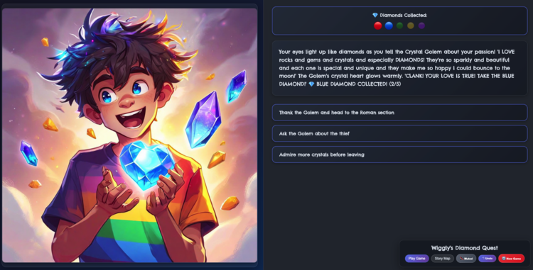

# Wiggly's Diamond Quest

## 🎮 [**PLAY HERE →**](https://wigglys-diamond-quest.netlify.app/)



A small interactive story game/book created by my son and me. The story was generated using Claude AI, guided by my son's creative ideas. Follow Wiggly (a boy with crazy hair and a rainbow t-shirt) as he helps recover stolen diamonds from a museum by exploring different themed rooms and making choices.

## Features

- **Interactive Web Game**: Play through the story with choices that affect the outcome
- **AI-Generated Images**: Uses AWS Bedrock Nova Canvas to generate Arcane League of Legends style illustrations for each scene
- **PDF Book Generation**: Creates printable books in two formats:
  - Readable version (normal page order)
  - Booklet version (reordered for 4-up printing and folding)
- **Story Visualization**: D3.js graph showing the decision tree structure and node validation

## Story Structure

The story is defined in `public/story.json` with this structure:

```json
{
  "startNode": "start",
  "nodes": {
    "node_id": {
      "text": "Story text for this scene",
      "image-text": "Description for AI image generation",
      "choices": [
        { "text": "Choice description", "next": "next_node_id" }
      ],
      "isEnd": true  // Optional, marks ending nodes
    }
  }
}
```

## AWS Integration

Images are generated using AWS Bedrock's Nova Canvas model with prompts optimized for the Arcane art style. Run `node generate-images.js` to generate missing images.

## PDF Generation

The PDF generator creates A5 format books with:
- Chelsea Market font
- Page numbers in squares (alternating left/right)
- Two versions: readable and booklet (for 4-up printing)

For home printing: Use the booklet version, print 4-up, flip paper, print reverse, cut in half, and stack for correct page order.

## Quick Start

```bash
npm install
npm run dev
```

Visit the web interface to play the game or use the visualization tab to explore the story structure.